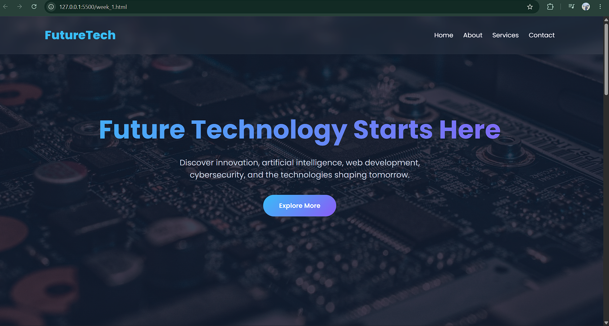

#  FutureTech Hub - Modern Static Website

A responsive static website built using **HTML5 and CSS3**.  
This project demonstrates modern UI design, responsive layouts, and frontend fundamentals.

##  Project Overview

FutureTech Hub is a futuristic technology-themed website designed for learning and practice.  
It includes multiple sections like hero, about, services, stats, and contact — all styled with modern CSS techniques such as glassmorphism, gradients, and animations.

## Features

-  Modern dark-themed UI design
-  Fully responsive layout (mobile, tablet, desktop)
-  Sticky navigation bar
-  Hero section with gradient text & CTA button
-  Glassmorphism-style service cards
-  Smooth hover animations & transitions
-  Statistics section with highlights
-  Contact section with basic info layout
-  High-quality background images

## 🛠️ Tech Stack

- HTML5
- CSS3
- Google Fonts (Poppins)
- Flexbox
- CSS Grid
- CSS Animations & Transitions

## 📁 Project Structure

## 🚀 How to Run

1. Download or clone the repository
2. Open the folder
3. Double-click `week_1.html`
4. Run in any modern browser

---

## 🎯 Learning Goals

This project helps you understand:

- HTML semantic structure
- CSS layout systems (Flexbox & Grid)
- Responsive web design
- Modern UI/UX styling techniques
- Hover effects and animations

---

## 📱 Responsiveness

The website is optimized for:

-  Mobile devices
-  Tablets
-  Desktop screens

---

##  Developer

**Arian Kumar**  
Computer Science Student  
Frontend Developer (Learning Phase)

---

## 📸 Preview

---

## 📌 Future Improvements

- Add JavaScript interactivity
- Add contact form functionality
- Convert into full React website
- Add backend integration (Node.js + MySQL)
- Add dark/light mode toggle

---

## 📜 License

This project is created for **educational purposes** and is free to use for learning and practice.

---

⭐ If you like this project, don’t forget to star the repo!